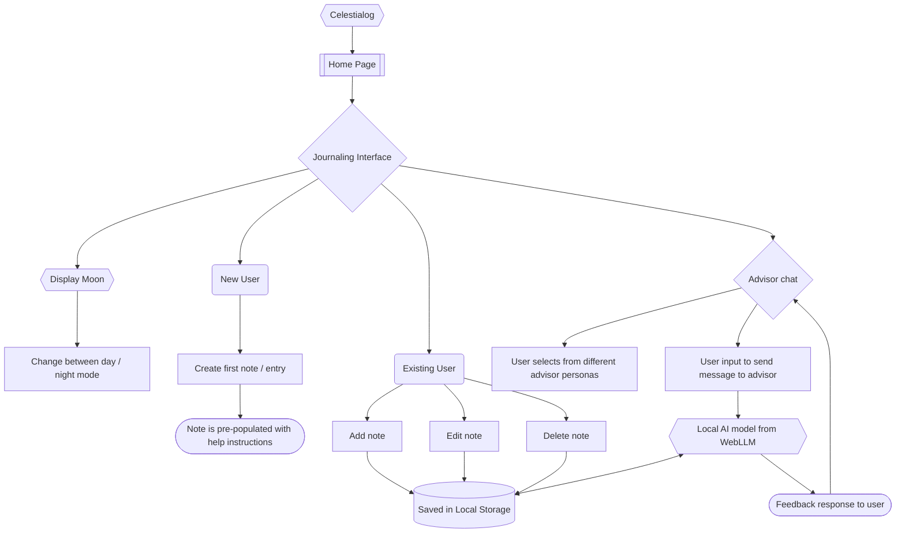

# celestialog

## Project Rationale:

> [!NOTE]
> Section currently in progress.

## UX
### The 5 Planes of UX

#### 1. Strategy

**Purpose**:
> *A mystical and atmospheric journaling tool, where users can write, reflect, and consult archetypal advisors - all privately, locally, and without accounts.*

- Create an immersive and atmospheric journaling experience for users.
- Offer users the means to reflect on their day with environmental context, such as *moon phases* and *day-time, night-time themes*.
- Allow users to interact with *persona-based advisors* for guidance or inspiration in their journaling.

**Primary User Needs**:
- Create notes and journal entries that can be saved, edited, and deleted.
- Accessible in browser, without requiring sign-ups or cloud storage, making it a private experience for the user.
- Tools that support creativity, immersion, and introspection through dialouge with the self.

**Primary User Profiles**:
- The *Moon Gazer*:
> *"Those who may find comfort in immersing themselves in the astrological to empower their journaling. They find inspiration and meaning through understanding the phases of the moon."* 

- The *Playful Explorer*:
> *"Keen, and drawn to the interactive advisor personas, they find magic through world-building in dialogue to explore their inner thoughts and ideas."*

- The *Reflective Writer*:
> *"A thoughtful soul looking for a quiet, personal space to explore their emotions and experiences. They do not necessarily seek the guidance of advisors, but are grateful for the option."*

**Business Goals**:
- Create a unique, story-driven journaling experience that distinguishes itself thematically from other generic note-taking / wellness apps.
- Improve user retention by offerring an engaging USP to accompany standard journaling / note-taking tools.
- Build a scalable framework and prototype, that allows for further development into future features or products: *tarot-like decks, physical books, persona packs, and interactive fiction*.

#### 2. Scope

**Features**:
- (see a breakdown here: [Features](#features))

**Content Requirements**:
- Responsive site that works across all devices and common browsers.
- Functional journal with features to write, edit, and delete entries.
- Interact with an advisor about journaling, with the option to select from multiple personas.
- Moon information displayed to the user is clear, accurate, and up to date.
- Onboarding text containing brief instructions to get the user set-up and accustomed to features.
- Unified and coherent theme to set the appropriate tone for an immersive feeling app.

#### 3. Structure

**Information Architecture**:
- **Navigation menu**:
    - Accessible links in the navbar to relevant sections: Home, About, Contact.
- **Information layout**:
    - Structure of main website features arranged in order of priority: *Journal > Advisor chat > Persona selection > Moon information.*
- **Hierarchy**:
    - Easy to understand navigation bar.
    - Main content features, structured appropriately.
    - Clear call-to-action buttons.
    - Contact information in footer, with prominent placement of social media links.

**User Flow**:
- Flowchart diagram to illustrate the primary user flow through the main content features.

- Users may also navigate to additional About, Contact pages to further learn about the website, or contact the developer.