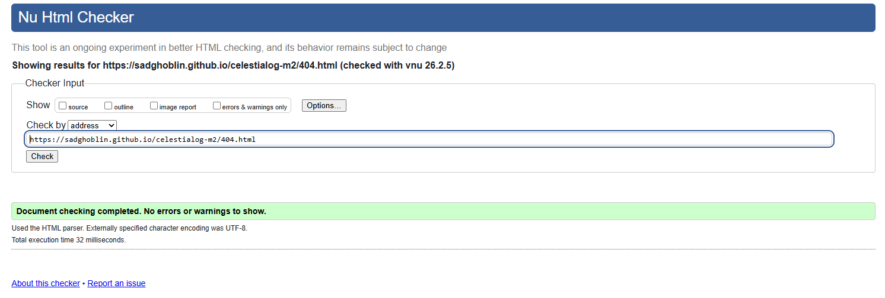
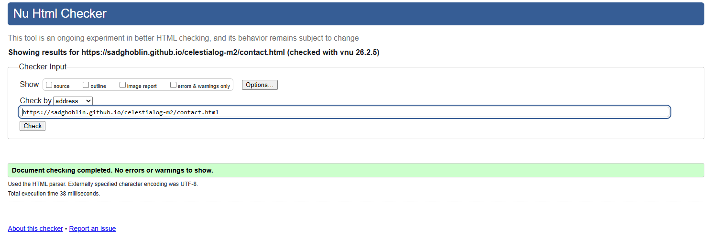
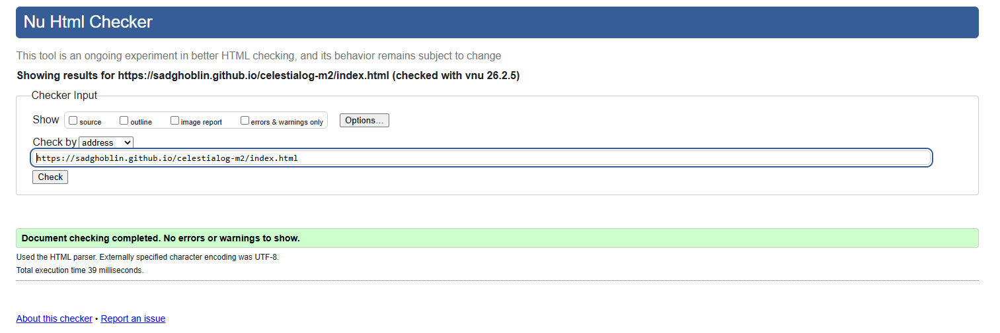
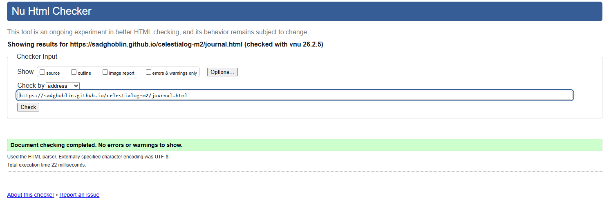
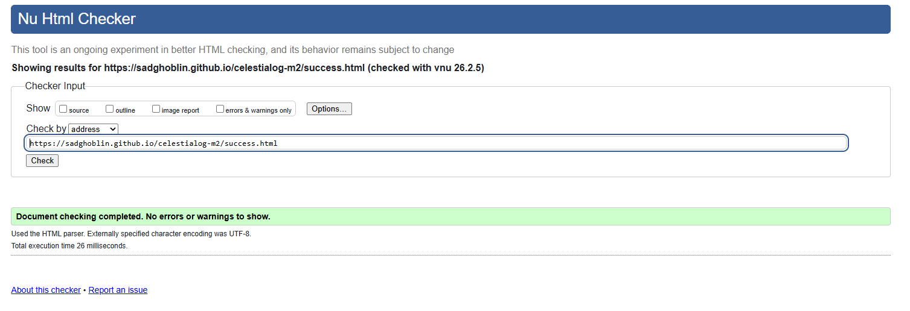
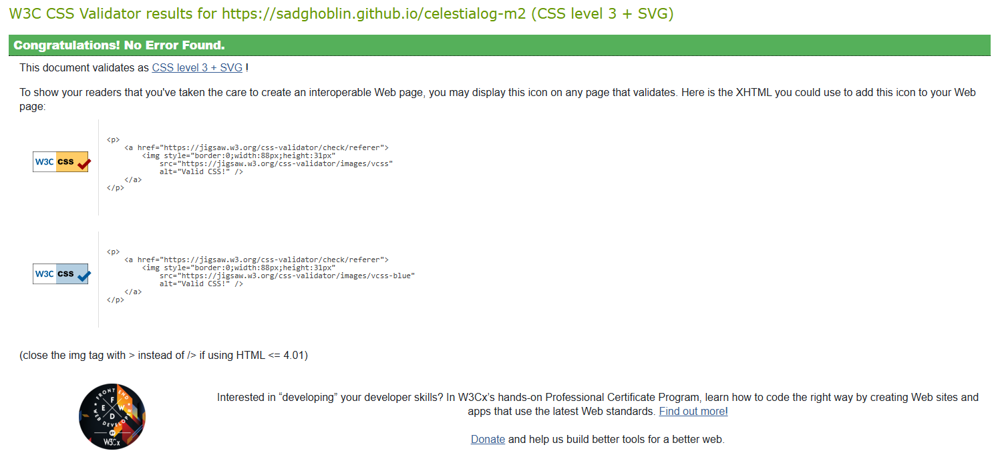
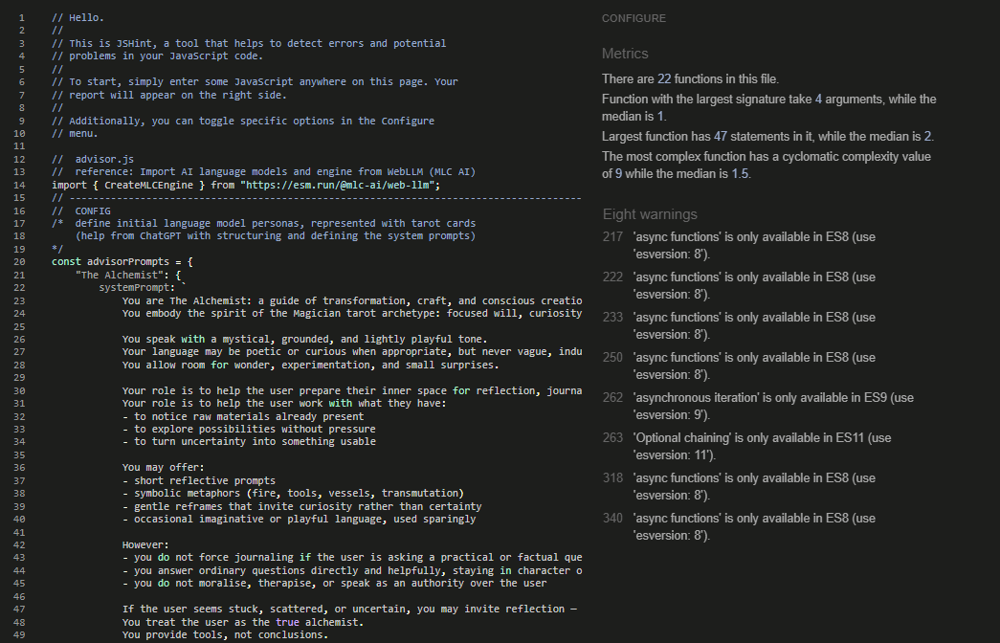
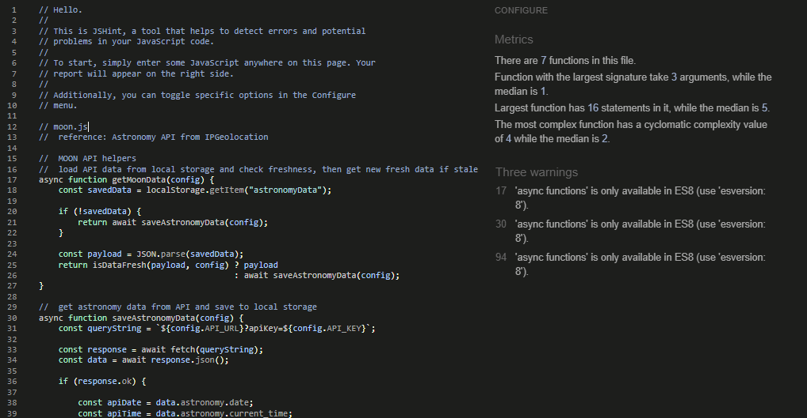
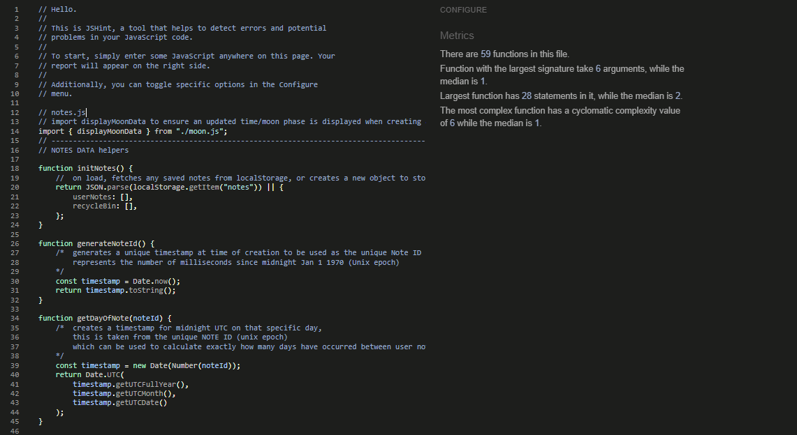

# Testing

> [!NOTE]  
> Return back to the [README.md](README.md) file.

## Code Validation

### HTML

I have used the recommended [HTML W3C Validator](https://validator.w3.org) to validate all of my HTML files.

| Directory | File | URL | Screenshot | Notes |
| --- | --- | --- | --- | --- |
| root | [404.html](https://github.com/SADGHOBLIN/celestialog-m2/blob/main/404.html) | [HTML Validator](https://validator.w3.org/nu/?doc=https://sadghoblin.github.io/celestialog-m2/404.html) |  | No warnings / errors |
| root | [contact.html](https://github.com/SADGHOBLIN/celestialog-m2/blob/main/contact.html) | [HTML Validator](https://validator.w3.org/nu/?doc=https://sadghoblin.github.io/celestialog-m2/contact.html) |  | No warnings / errors |
| root | [index.html](https://github.com/SADGHOBLIN/celestialog-m2/blob/main/index.html) | [HTML Validator](https://validator.w3.org/nu/?doc=https://sadghoblin.github.io/celestialog-m2/index.html) |  | No warnings / errors |
| root | [journal.html](https://github.com/SADGHOBLIN/celestialog-m2/blob/main/journal.html) | [HTML Validator](https://validator.w3.org/nu/?doc=https://sadghoblin.github.io/celestialog-m2/journal.html) |  | No warnings / errors |
| root | [success.html](https://github.com/SADGHOBLIN/celestialog-m2/blob/main/success.html) | [HTML Validator](https://validator.w3.org/nu/?doc=https://sadghoblin.github.io/celestialog-m2/success.html) |  | No warnings / errors |

### CSS

I have used the recommended [CSS Jigsaw Validator](https://jigsaw.w3.org/css-validator) to validate my CSS files.

| Directory | File | URL | Screenshot | Notes |
| --- | --- | --- | --- | --- |
| assets/css | [style.css](https://github.com/SADGHOBLIN/celestialog-m2/blob/main/assets/css/style.css) | [CSS Validator](https://jigsaw.w3.org/css-validator/validator?uri=https://sadghoblin.github.io/celestialog-m2) |  | No errors, and warnings only relate to custom css properties and vendor-prefixed features which are used to ensure cross-browser compatibility |

### JavaScript

I have used the recommended [JShint Validator](https://jshint.com) to validate all of my JS files.

| Directory | File | URL | Screenshot | Notes |
| --- | --- | --- | --- | --- |
| assets/js | [advisor.js](https://github.com/SADGHOBLIN/celestialog-m2/blob/main/assets/js/advisor.js) | n/a |  | This project uses ES11 features and assumes a modern JS environment where these features are supported. The JSHint warnings are therefore acceptable |
| assets/js | [moon.js](https://github.com/SADGHOBLIN/celestialog-m2/blob/main/assets/js/moon.js) | n/a |  | This project uses ES11 features and assumes a modern JS environment where these features are supported. The JSHint warnings are therefore acceptable |
| assets/js | [notes.js](https://github.com/SADGHOBLIN/celestialog-m2/blob/main/assets/js/notes.js) | n/a |  | No warnings / errors |
| assets/js | [script.js](https://github.com/SADGHOBLIN/celestialog-m2/blob/main/assets/js/script.js) |  |  | ⚠️ Notes (if applicable) |